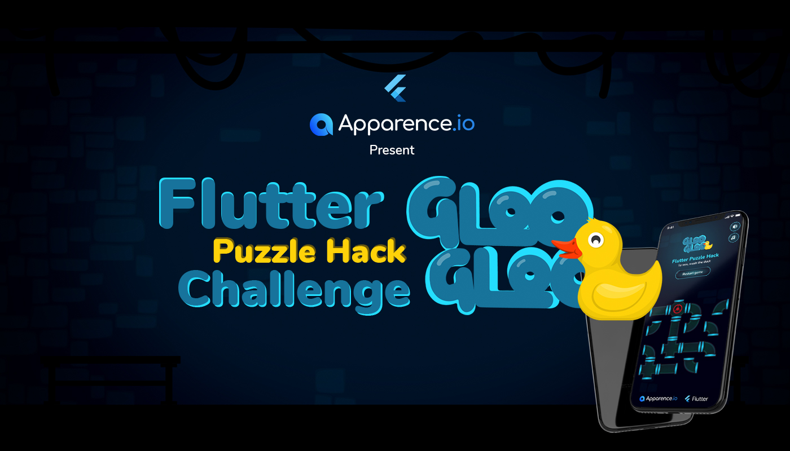

  
   

  
   

![coverage][coverage_badge]
[![License: MIT][license_badge]][license_link] 
 
  

# **Slide puzzle flutter challenge 2022**

Developed with 💙  by Apparence.io

Gameplay
-
This puzzle game is a bit different from other water pipes games. You can't rotate the pipes, only a slide is allowed! There's one empty space where you will be able to swipe your pipes and organize them to found a solution.

**Move the pipes with your finger to create a way to let the water flow to the duck.
Are you ready to play?   
[🦆 Click here to play !](https://flutter-challenge-2022.web.app/)**

Features
-
- Random puzzle generation
- Solvability checker, to make sure random generated puzzle have solution
- Rive animations
- Multiplatform (Web, iOS, Android)
- Music & Sounds
- Custom design

Packages used
-
(confetti, dart_code_metrics, equatable, intl, just_audio, logging, rive, universal_platform)

[coverage_badge]: coverage_badge.svg
[license_badge]: https://img.shields.io/badge/license-MIT-blue.svg
[license_link]: https://opensource.org/licenses/MIT
